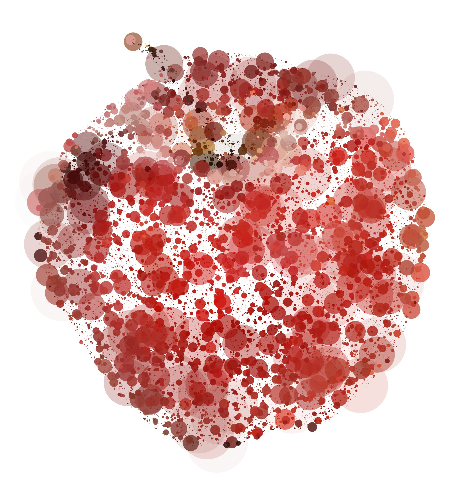

# An Exploration of Computer Based Pointillism
This repository contains code used in Katarina Hoeger's exploration of pointillism using a computer.

## Why This Technique?

### Pointillism
Pointillism was developed in 1886 by [Georges-Pierre Seurat](https://www.moma.org/collection/works/79333?sov_referrer=art_term&art_term_slug=pointillism).
It involves creating shapes by using small dots of color.

### Inspiration
During Summer 2021, Katarina wanted to modify a photograph using different image processing coding techniques in processing.
She stumbled across code for [pointillism](http://learningprocessing.com/examples/chp15/example-15-14-Pointillism).
Using this as a base, she started making changes with the code, slowly changing the aesthetic of the output.

### Major Ideas
- To Katarina, a non-painter, the painting process looks like the following: Painters often layer paint, with wider, less precise, and more translucent brushstrokes in the background. They often add thinner, more precise, and bolder brushstrokes on top. The code should emulate this.
- A picture is a dataset. If you can access the Red, Green, Blue, and Alpha values of a reference picture, you can use that data to construct a facsimile of the picture.
- Computer users can take advantage of pseudorandom numbers to generate unique but recognizably similar in style copies of the original picture.

## Code-based Exploration

### Code Types

### Testing Limits

### To Do
